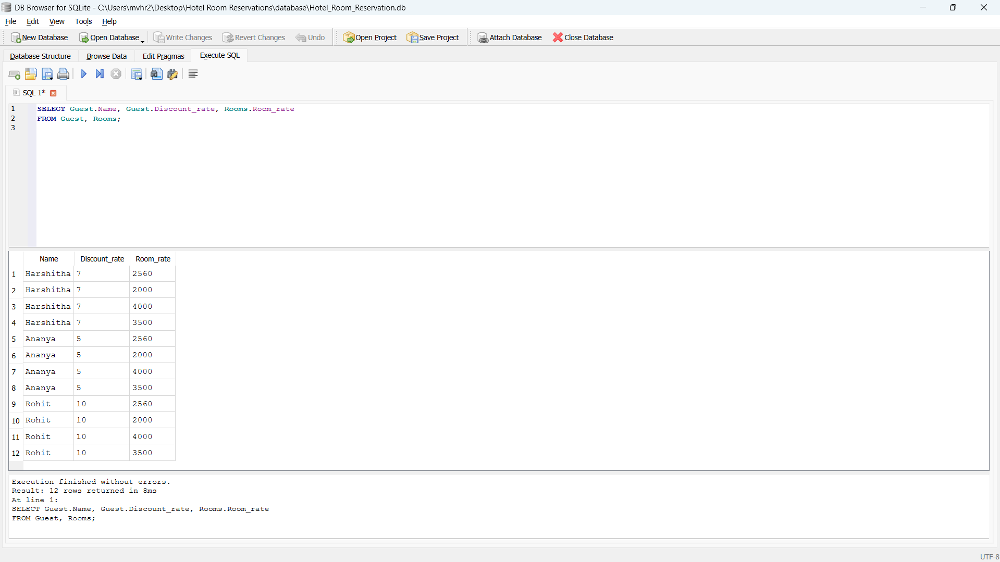
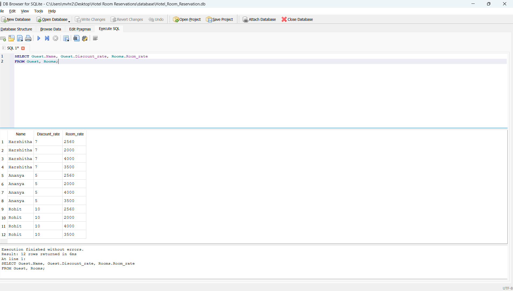
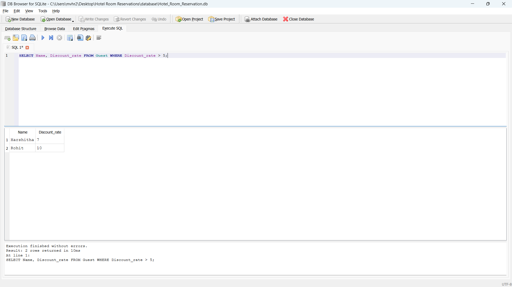
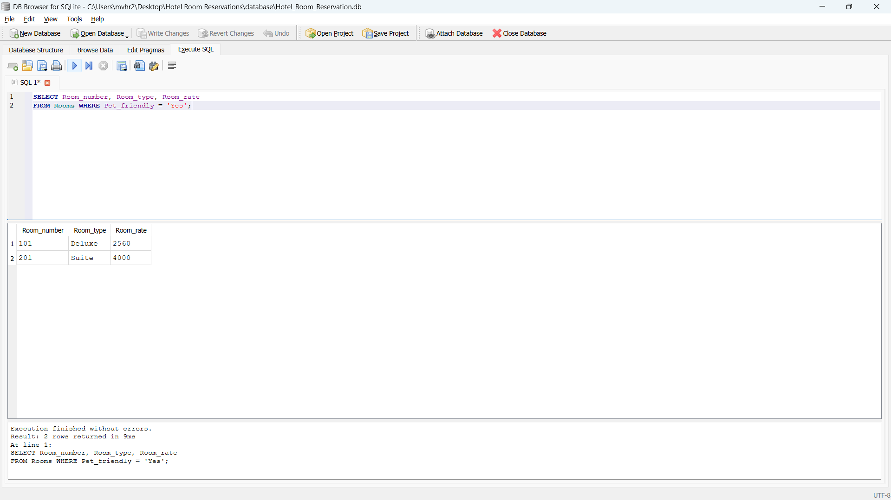
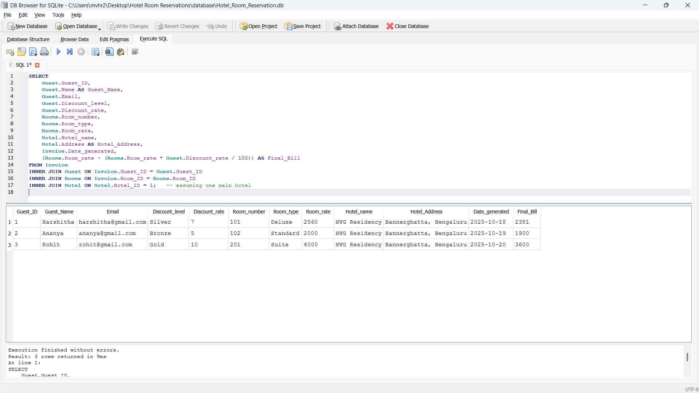
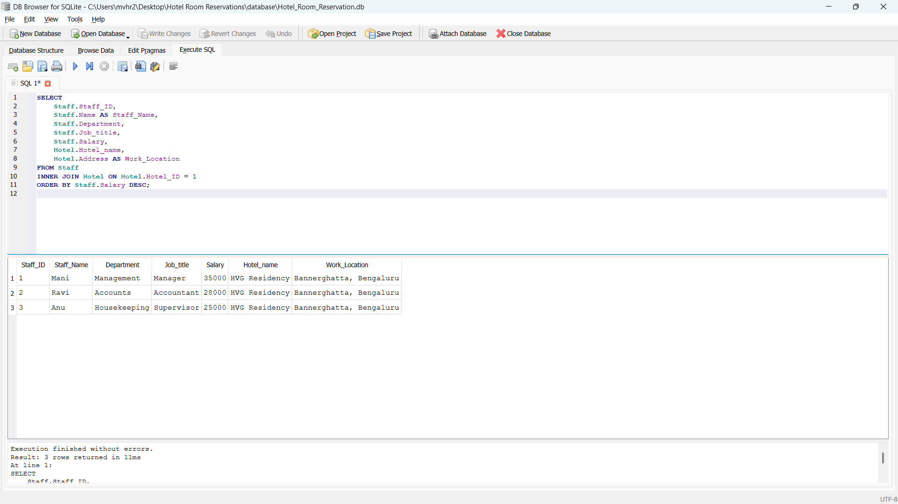

# 🏨 Hotel Room Reservation System

A complete database management project built using Python (SQLite3) for managing hotel operations — including rooms, guests, staff, hotel info, and invoices.  
The project demonstrates how to design, query, and manage relational databases efficiently using Jupyter Notebook and DB Browser for SQLite.

---

## Features
- Database schema designed with 5 main entities:
  - Hotel
  - Staff
  - Rooms
  - Invoice
  - Guest
- Implementation of CRUD operations (Create, Read, Update, Delete)
- INNER JOINs and complex SQL queries for reporting and analytics
- Dynamic discount and final billing calculations
- Integration between Python (sqlite3) and SQLite Database
- Tested using both Jupyter Notebook and DB Browser for SQLite

---

## Tech Stack
- Programming Language: Python  
- Database: SQLite3  
- Libraries: sqlite3, pandas  
- Tools: Jupyter Notebook, DB Browser for SQLite  

---

## Key SQL Queries (11 Total)
The project includes 6 queries demonstrating:
1. Selecting and displaying all records from each table  
2. Applying filtering conditions (`WHERE`, `ORDER BY`)  
3. Using `INNER JOIN` to connect Guest, Rooms, Invoice, and Hotel tables  
4. Calculating final billing amounts with discounts  
5. Displaying staff hierarchy and salary analysis  
6. Listing pet-friendly and non-smoking rooms  
7. Generating hotel reports using joins and aggregation (`SUM`, `AVG`)

---

## Screenshots

### Table Outputs
| Table | Screenshot |
|--------|-------------|
| Hotel Table |  |
| Staff Table |  |
| Rooms Table |  |
| Guest Table |  |
| Invoice Table |  |

---

### Query Outputs
| Query | Screenshot |
|--------|-------------|
| Query 1 |  |
| Query 2 |  |
| Query 3 |  |
| Query 4 |  |
| Query 5 |  |
| Query 6 |  |
---

